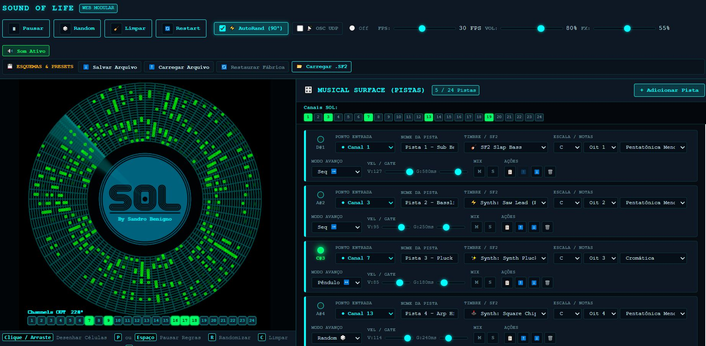

# 🌐 SOUND OF LIFE (SOL)



> **Sequenciador e Controlador de Música Generativa baseado em Autômato Celular (Conway's Game of Life) e Radar Polar.**  
> *Original: Desenvolvido em Processing (Sandro Benigno, Fevereiro/2021)*  
> *Arquitetura Web Modular & Python Bridge (Sandro Benigno, Setembro/2026)*


Experimente a [Versão Online](https://sandrobenigno.github.io/Sound_Of_Life/)
---

## 📖 1. Visão Geral do Projeto

O **SOUND OF LIFE (SOL)** é um instrumento e controlador generativo visual que une matemática, dinâmica de sistemas complexos e música. Ele mapeia o autômato celular do **Jogo da Vida de Conway (Game of Life)** sobre uma grade geométrica de **coordenadas polares (estilo RADAR circular)**.

Nesta versão **Web Modular**, o sistema foi completamente reformulado sob uma arquitetura desacoplada em 3 camadas independentes, garantindo que o núcleo visual/matemático seja 100% agnóstico à síntese sonora, comunicando-se via **WebSockets**, **Web Audio API** interna e uma **Bridge OSC em Python** para integração com DAWs e sintetizadores externos.

---

## 🏛️ 2. Diagrama da Arquitetura

```
┌──────────────────────────────────────────────────────────────────────────────────┐
│                               SOL CORE                                           │
│  • Autômato Celular Conway B3/S23 em topologia toroidal                          │
│  • Grade Polar: 72 fatias radiais (5°) x 24 trilhas concêntricas                 │
│  • Feixe de Varredura (Scanner) com rotação contínua e rastro fosforescente      │
│  • Interação direta: desenhar e apagar células com mouse/touch                   │
│  • 100% Agnóstico de áudio — Apenas gerador de eventos                           │
└───────────────────────────────────┬──────────────────────────────────────────────┘
                                    │
                                    │  Eventos Abstratos (JSON / WebSockets)
                                    ▼
┌──────────────────────────────────────────────────────────────────────────────────┐
│                        MUSICAL SURFACE                                           │
│  • Rack dinâmico de pistas (Classe Track — até 24 pistas verticais)              │
│  • Mapeamento flexível para os 24 pontos de entrada do SOL                       │
│  • Listas Circulares de Notas e Catálogo de Escalas Musicais                     │
│  • Modos de Avanço: Sequencial (➡️/⬅️), Random (🎲), Pêndulo (↔️), Fatia (🎯)  │
│  • Controles de Dinâmica: Velocity, Duração de Gate (ms), Probabilidade          │
│  • Gerenciador de Esquemas: Salvar/Carregar (.sol.json) e Reset de Fábrica      │
└───────────────────────────────────┬──────────────────────────────────────────────┘
                                    │
                                    │  Comandos de Disparo de Notas
                                    ▼
┌────────────────────────────────────────────────────────────────────────────────┐
│                          SOUND ENGINE                                          │
│  • Sintetizador Polifônico Nativo Web Audio (Saw, Square, Sine, FM...)         │
│  • SF2 Player (Piano, Rhodes, Marimba, Celesta, Strings, Slap Bass...)         │
│  • Carregador dinâmico de arquivos SoundFont (.sf2) locais                     │
│  • Mixer Master com Limitador Anti-Clipping e Efeito Delay/Reverb              │
└────────────────────────────────────────────────────────────────────────────────┘
                                    ▲
                                    │  Opcional (Ponte Externa)
┌───────────────────────────────────┴────────────────────────────────────────────┐
│                        PYTHON OSC BRIDGE                                       │
│  • Escuta eventos de varredura via WebSocket (porta 8765)                      │
│  • Transmite pacotes OSC UDP para 127.0.0.1:5500 na rota /sol                  │
│  • Compatível com Ableton Live, Reaper, Max/MSP, PureData, SuperCollider       │
└────────────────────────────────────────────────────────────────────────────────┘
```

---

## 📁 3. Estrutura de Pastas e Arquivos

```
SoundOfLife_WEB/
├── bridge/                          # Módulo de Ponte Externa & Servidor
│   ├── server.py                    # Servidor integrado (HTTP + WebSocket + OSC)
│   ├── sol_bridge.py                # Ponte independente WebSocket -> OSC UDP
│   └── requirements.txt             # Dependências Python (websockets, python-osc)
│
├── public/                          # Ativos Estáticos
│   ├── assets/
│   │   └── sol.png                  # Logotipo e arte central original do SOL
│   ├── soundfonts/                  # Diretório para SoundFonts SF2
│   └── presets/                     # Presets e esquemas padrão em JSON
│
├── src/                             # Código Fonte da Aplicação Web (ESM Nativo)
│   │
│   ├── core/                        # Módulo 1: SOL Core (100% Agnóstico a Som)
│   │   ├── GameOfLife.js            # Engine do autômato toroidal (72x24, regras B3/S23)
│   │   ├── PolarGeometry.js         # Trigonometria polar e conversão tela <-> radar
│   │   ├── RadarRenderer.js         # Renderizador Canvas 2D (estética radar fosforescente)
│   │   ├── SolBroadcaster.js        # Emissor de eventos internos e cliente WebSocket
│   │   └── SolCore.js               # Gerenciador de clock, scanner e ciclo de evolução
│   │
│   ├── surface/                     # Módulo 2: Musical Surface & Gerenciador de Pistas
│   │   ├── Track.js                 # Classe Track individual (regras, fonte, escala, modo)
│   │   ├── TrackManager.js          # Gerenciador do rack de até 24 pistas de áudio
│   │   ├── CircularList.js          # Estrutura de lista circular com modos de cursor
│   │   ├── ScaleCatalog.js          # Teoria musical, gerador de escalas e conversor de notas
│   │   └── SchemaManager.js         # Exportação/Importação JSON e Esquema Padrão
│   │
│   ├── audio/                       # Módulo 3: Sound Engine (Síntese & Amostras)
│   │   ├── WebAudioSynth.js         # Sintetizador polifônico com envelopes ADSR e filtros
│   │   ├── SF2Player.js             # Reprodutor de SoundFonts e instrumentos acústicos
│   │   └── SoundEngine.js           # Mixer master, limiter anti-clipping e reverb/delay
│   │
│   ├── ui/                          # Componentes de Interface do Usuário
│   │   ├── RadarCanvas.js           # Interação com o radar (mouse, arrasto, atalhos)
│   │   ├── TrackListView.js         # Rack vertical de pistas com LEDs em tempo real
│   │   ├── TransportBar.js          # Barra de transporte (Play, FPS, Volume, Status)
│   │   └── SchemaControls.js        # Painel de salvar/carregar esquemas e arquivos .sf2
│   │
│   ├── main.js                      # Bootstrap: inicializa e conecta todos os módulos
│   └── style.css                    # Estilo moderno Cyberpunk / Studio Rack escuro
│
├── index.html                       # Ponto de entrada HTML5 da aplicação
└── README.md                        # Documentação completa
```

---

## ⚙️ 4. Detalhamento dos Módulos

### 1. `SOL Core` (`src/core/`)
- **`GameOfLife.js`**: Matriz de $72 \text{ fatias} \times 24 \text{ trilhas}$. Aplica conexão toroidal nas bordas radiais e angulares (`% cols`, `% rows`). Células vivas com 2 ou 3 vizinhos sobrevivem; células mortas com 3 vizinhos nascem; demais morrem.
- **`PolarGeometry.js`**: Converte coordenadas do ponteiro do mouse $(X, Y)$ para a célula correspondente $(\text{coluna}, \text{linha})$ através de `Math.atan2` e distância euclidiana.
- **`RadarRenderer.js`**: Desenho no HTML5 Canvas utilizando efeito de *fading background* (`rgba(0, 0, 0, 0.15)`) para recriar o feixe fosforescente do Processing original, núcleo central com a logo `sol.png`, células ativas com brilho estocástico e monitor de LEDs dos 24 canais no canto inferior esquerdo.
- **`SolBroadcaster.js`**: Emite eventos `radar_step` contendo o ângulo atual, índice da fatia e o estado booleano dos 24 canais, tanto para a camada JavaScript interna quanto para o servidor WebSocket (`ws://127.0.0.1:8765`).
- **`SolCore.js`**: Controla o clock e a rotação do feixe (0° a 359°), acionando a leitura de fatias e nova geração da vida a cada 5° de giro.

### 2. `Musical Surface` (`src/surface/`)
- **Classe `Track`**: Modela uma pista individual com:
  - `inputChannel`: Ponto de entrada do SOL que dispara a pista (0 a 23).
  - `soundSource`: Timbre associado (Sintetizador ou SF2).
  - `circularList`: Lista circular de notas.
  - `advanceMode`: Modo como o cursor percorre as notas a cada disparo:
    - *Sequential Forward (`seq_fwd`)*: Avança 1 nota para frente.
    - *Sequential Backward (`seq_bwd`)*: Retrocede 1 nota.
    - *Random (`random`)*: Escolhe aleatoriamente uma nota da lista.
    - *Pendulum (`pendulum`)*: Avança até a última nota e retorna (efeito ping-pong).
    - *Direct Slice (`direct`)*: A nota é indexada pelo ângulo/fatia atual do radar.
  - `velocity`: Intensidade da nota (fixa, faixa aleatória ou proporcional ao raio).
  - `duration`: Duração do gate em milissegundos (50ms a 1000ms).
  - `probability`: Chance percentual de tocar a nota (0% a 100%).
  - `mute` / `solo`: Controles individuais de mixagem.
- **`TrackManager.js`**: Permite adicionar até 24 pistas dinamicamente (de cima para baixo). Informa quais canais estão livres e mapeados.
- **`ScaleCatalog.js`**: Catálogo completo de escalas musicais (Pentatônica Menor/Maior, Eólio/Menor Natural, Jônio/Maior, Dórico, Frígio, Lídio, Mixolídio, Menor Harmônica, Blues, Hirajoshi, Insen, Árabe, Tons Inteiros e Cromática).
- **`SchemaManager.js`**: Serializa o estado das pistas em arquivos `.sol.json` para download, importa arquivos JSON e gerencia a restauração do **Esquema Padrão de Fábrica**.

### 3. `Sound Engine` (`src/audio/`)
- **`WebAudioSynth.js`**: Sintetizador nativo com envelopes ADSR exponenciais limpos (sem estalos), osciladores *Sawtooth*, *Square*, *Triangle*, *Sine*, *Synth Pluck* (filtro rápido descendente) e *FM Bell* (modulação de frequência metálica).
- **`SF2Player.js`**: Timbres acústicos e modelados (Grand Piano, Rhodes Electric Piano, Marimba/Mallet, Celesta, Pizzicato Strings, Slap Bass, Synth Brass) e suporte para carregar arquivos `.sf2` externos através do botão da interface.
- **`SoundEngine.js`**: Mixer central com limitador estéreo (`DynamicsCompressor`) que evita saturação/clipping mesmo quando 24 vozes soam juntas, além de linha de atraso/reverb estéreo.

### 4. `Python Bridge & Servidor Integrado` (`bridge/`)
- **`bridge/server.py`**: Servidor 3-em-1 em Python puro:
  - **Servidor Web HTTP**: Disponibiliza a interface em `http://localhost:8080`.
  - **Servidor WebSocket**: Escuta eventos do SOL na porta `8765`.
  - **Transmissor OSC UDP**: Envia mensagens `/sol` na porta `5500` (padrão do Processing original).
- **`bridge/sol_bridge.py`**: Ponte independente WebSocket -> OSC para quem deseja rodar o frontend em outro servidor.

---

## 🚀 5. Como Executar

### Pré-requisitos
- **Python 3.10+** instalado (com os pacotes `websockets` e `python-osc`).

### Instalação das dependências Python:
```bash
pip install -r bridge/requirements.txt
```

---

### Execução Recomendada (Servidor Completo Integrado):
```bash
python bridge/server.py
```

Isso inicializa simultaneamente:
1. **Aplicação Web**: Acesse pelo navegador em **[http://localhost:8080](http://localhost:8080)**.
2. **WebSocket Hub**: Ativo em `ws://127.0.0.1:8765`.
3. **Roteador OSC UDP**: Enviando para `127.0.0.1:5500` na rota `/sol`.

---

### Execução Apenas do Frontend Web:
Se preferir usar seu próprio servidor estático (como VS Code Live Server ou `python -m http.server 8080`):
- Abra o navegador em `http://localhost:8080`.
- Se desejar comunicação OSC externa, execute em outro terminal `python bridge/sol_bridge.py` e marque o checkbox **`📡 OSC UDP`** na barra superior de transporte. Por padrão, a conexão externa fica desligada para não solicitar permissões de rede local desnecessárias.

---

## 🎛️ 6. Guia de Operação & Atalhos

### 🖱️ Interação com o Radar
- **Botão Esquerdo do Mouse (Clique e Arraste)**: Desenha ou apaga células vivas diretamente na grade circular do radar.
- **Detecção Inteligente**: O primeiro clique define se o arrasto irá pintar ou apagar células.

### ⌨️ Atalhos de Teclado
| Tecla | Ação |
|---|---|
| <kbd>P</kbd> ou <kbd>Espaço</kbd> | **Pausar / Retomar** a evolução das regras do Game of Life |
| <kbd>R</kbd> | **Randomizar** as células do radar mantendo a posição do feixe |
| <kbd>C</kbd> | **Limpar** (*Clear*) todas as células do tabuleiro |
| <kbd>I</kbd> | **Reiniciar** (*Initialize*) o tabuleiro aleatoriamente e voltar o feixe ao grau 0 |

---

## 💾 7. Gerenciamento de Esquemas e Presets

No painel superior **ESQUEMAS & PRESETS**:
1. **`⬇️ Salvar Arquivo`**: Gera e baixa um arquivo `.sol.json` contendo todas as pistas configuradas, instrumentos, escalas e velocidades.
2. **`⬆️ Carregar Arquivo`**: Abre uma janela para selecionar e aplicar qualquer arquivo `.sol.json` salvo previamente.
3. **`🔄 Restaurar Fábrica`**: Restaura o esquema padrão inicial de fábrica (5 pistas equilibradas entre Sub Bass, Bassline, Pluck, Arp e Chime).
4. **`📂 Carregar .SF2`**: Permite carregar seus próprios arquivos SoundFont `.sf2` locais para uso nas pistas.

---

## 📡 8. Protocolo de Comunicação OSC e WebSockets

### Pacote WebSocket (JSON)
Emitido a cada 5° de varredura do radar:
```json
{
  "type": "radar_step",
  "angle": 90,
  "sliceIndex": 18,
  "totalSlices": 72,
  "totalTracks": 24,
  "activeTracks": [0, 2, 8, 14],
  "trackStates": [true, false, true, false, false, false, false, false, true, ...]
}
```

### Pacote OSC UDP (Porta 5500, Rota `/sol`)
Idêntico à especificação original do Processing:
- **Rota**: `/sol`
- **Tipos**: `[int, int, int, ..., int]` (25 argumentos)
- **Valores**: `[frame, ch1, ch2, ch3, ..., ch24]` (onde `frame` é o ângulo de 0 a 359 e cada canal é `1` para ativo e `0` para inativo).

---

## 📄 Licença
Desenvolvido com base no conceito original do **Sound of Life** por **Sandro Benigno** (2021).
Código livre para fins educacionais, experimentação musical e desenvolvimento generativo.
